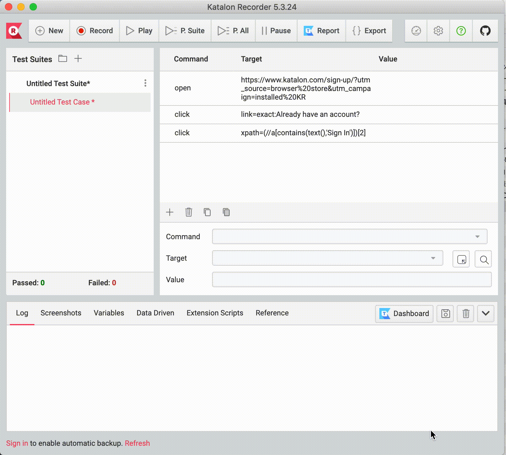

# katalon2puppeteer

transpiles json expoeted by katalon web recorder to node script using puppeteer.

## installation

`npm i katalon2puppeteer -g`

## Useage

`k2p -i './test.json'`

an example with optionis  
```shell
k2p \
    -i 'test/e2e/**/*.json' \
    --basicAuth username:password \
    --delay 2000
```

json files are supposed to be exported with [katalon web recorder](https://chrome.google.com/webstore/detail/katalon-recorder-selenium/ljdobmomdgdljniojadhoplhkpialdid).  
choose `JSON (via plugin)` in each testcase for export json files.  


## example

we are using Jest snapshot for testing.  
you can also find an execution result through the snapfile.  
the result js file would be similar to a [snap](__test__/__snapshots__/main.test.ts.snap) file 
when the input command is as the same as [test](__test__/main.test.ts).

## options (for runninng on CI)

`node ${generatedScript} ./new_capture_dir --headless`